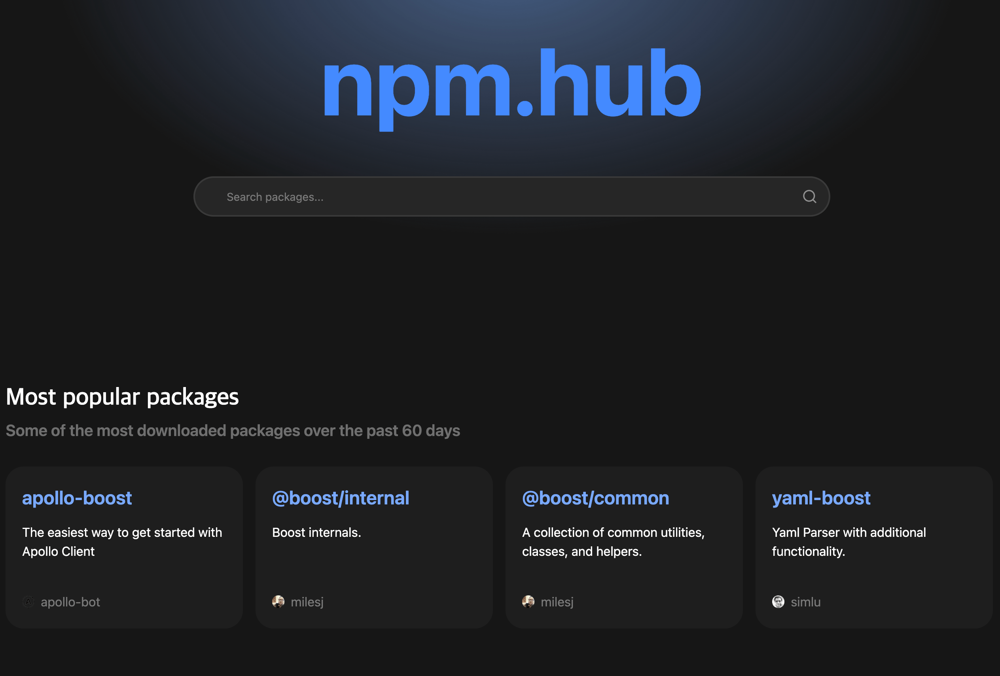
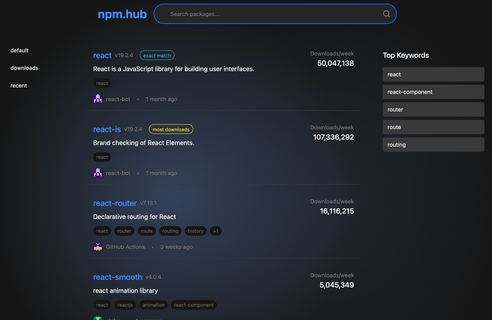
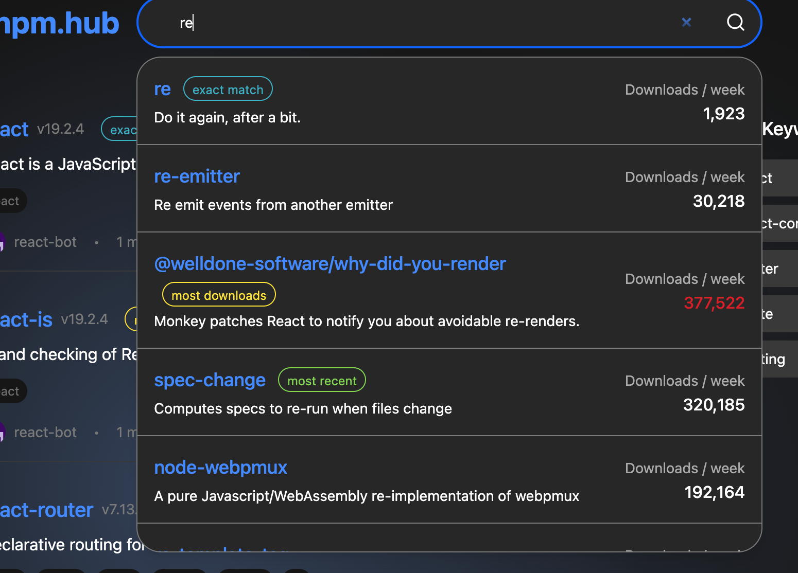
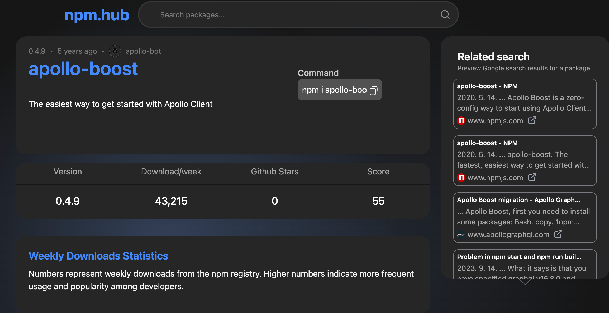
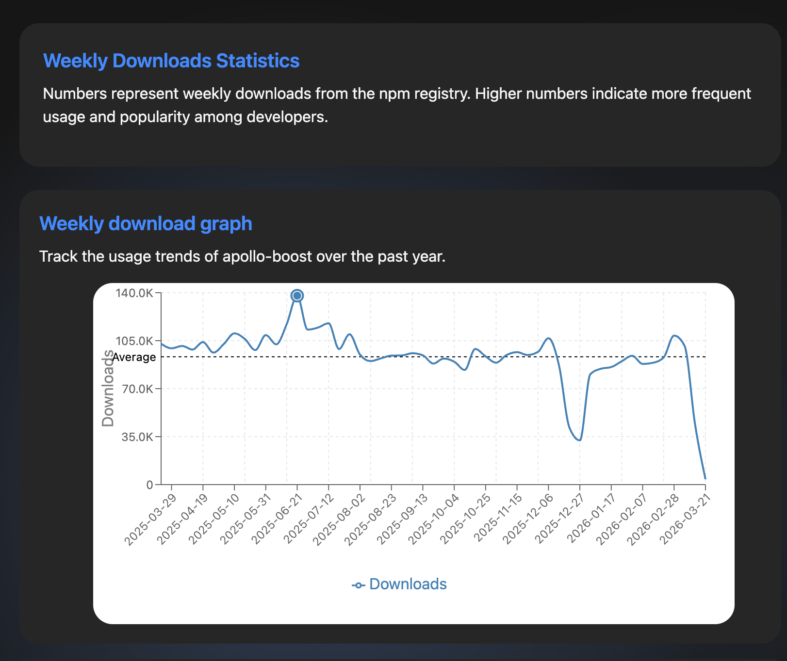
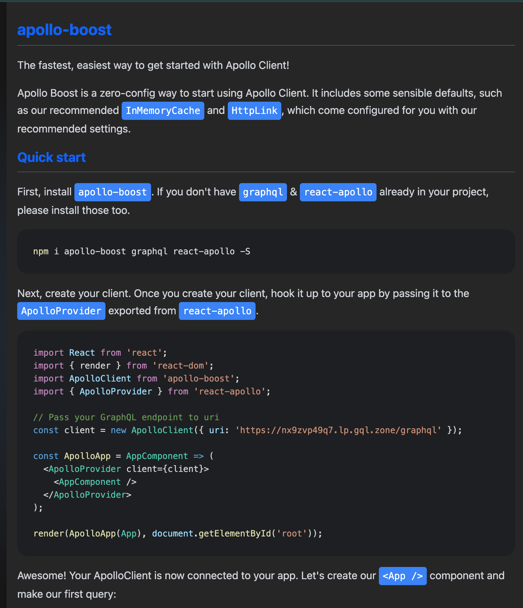

## 프로젝트 소개

**NPM Hub**는 **Next.js**, **TypeScript**, **Tailwind CSS** 기반의 **npm 패키지 검색·분석** 웹 애플리케이션이다. 인기 패키지 캐러셀, 키워드 검색, 패키지 상세(다운로드 추이, Google Trends, README 마크다운, 관련 검색) 등을 한 화면에서 탐색할 수 있다. **TanStack Query**로 서버 상태를 캐싱하고, **Recoil**·**Recharts**·**react-markdown** 등으로 UI와 시각화를 구성한다.

### 개발 기간

- 2024.09.01 ~ 2025.03.01

### 팀 소개

| 박지성 | [**우병희**](https://github.com/dnqudgml12) | 백예은 | 김현서 |
|---|---|---|---|
| 개발 | 개발 | 기획 | 디자인 |


## 주요 기술

### npm 레지스트리 · API 연동

공개 npm 레지스트리와 검색·다운로드 API URL을 **환경 변수**로 주입하고, **Axios**로 인기 패키지·검색·자동완성·상세 메타 등을 가져온다. 응답은 타입에 맞게 가공해 화면 컴포넌트에 넘긴다.

```ts
// app/api/npm.ts (요지)
const response = await axios.get<{ objects: PackageInfo[] }>(
  `${NPM_BASE_URL}${NPM_POPULAR_ENDPOINT}`,
);
```

### 클라이언트 캐시

자동완성·검색 결과·상세 조회 등은 **`CacheManager`**로 짧은 TTL·최대 개수를 두고 메모리 캐시해, 같은 쿼리에 대한 반복 요청을 줄인다. UI 레이어에서는 **TanStack Query**로 로딩·에러·재검증 흐름을 다룬다.

```ts
// app/api/npm.ts (요지)
const suggestionsCache = new CacheManager<Promise<SuggestionPackageInfo[]>>({
  maxSize: 100,
  expiryTime: 1000 * 60 * 5,
});
```

### 보조 API

Google Trends·Google Custom Search·이미지 프록시 등은 `app/api/` 하위 Route Handler에서 호출한다. (각각 `google-trends`, `google-search`, `image-proxy` 등.)

## 서비스 주소
https://npmhub.vercel.app/
---

## 시작 가이드

### 요구 사항

- Node.js (LTS 권장)
- npm 또는 pnpm (`pnpm-lock.yaml` 존재)

### 환경 변수

루트에 `.env.local` 등을 두고, `NEXT_PUBLIC_NPM_REGISTRY_URL`·`NEXT_PUBLIC_NPM_SEARCH_ENDPOINT`·`GITHUB_TOKEN` 등 **npm·GitHub·Google 연동에 필요한 키**를 설정한다. (전체 변수명은 `app/api/npm.ts` 및 `app/api/*`를 참고한다.)

### 설치 및 실행

```bash
git clone https://github.com/dnqudgml12/npm-hub.git
cd npm-hub   # 저장소 기본 폴더명; 로컬에서 npm.hub 등으로 바꿨다면 그 경로로 이동
npm install
```

**개발 서버**

```bash
npm run dev
```

**프로덕션 빌드 및 실행**

```bash
npm run build
npm start
```

### 기타 스크립트

```bash
npm run lint   # ESLint
```

---

## 기술 스택

### 개발 환경


### 언어 · 프레임워크


### 데이터 · UI


### 스타일 · 컴포넌트


### 도구


---

## 화면 구성


### 서비스 플로우



**지난 60일 다운로드가 많은 패키지를 캐러셀로 돌려 보여 주는 홈이다.**



**가운데에는 검색어에 대한 npm 검색 결과 목록이 표시된다. 왼쪽에서는 정렬을 바꿀 수 있는데, `default`는 기본 순서, `downloads`는 다운로드 수 내림차순, `recent`는 레지스트리의 `package.date`(마지막 배포·게시 시각) 기준으로 최근에 올라온 순이다. 정렬을 바꾸면 키워드 선택은 초기화된다. 오른쪽 `Top Keywords`는 현재 결과에 등장한 키워드 빈도 상위 5개를 보여 주며, 항목을 누르면 해당 문자열이 `package.keywords`에 포함된 패키지만 남긴다.**



**검색 입력 시 추천 패키지·자동완성 후보를 제시하는 UI이다.**



**패키지 상세 상단에서 이름·설명·작성자·키워드 등 메타 정보를 한눈에 보여 준다. 옆에는 Google Custom Search API로 npm 패키지 명으로 했을때 나온 결과를 보여준다.**



**주간 다운로드 등 수치·차트로 패키지 사용 추이를 보여 주는 통계 영역이다.**



**npm에 등록된 README를 마크다운으로 렌더링해 문서 본문을 확인하는 영역이다.**


---

## 아키텍처 및 디렉터리 구조

```text
npm.hub/
├── public/                 # 정적 자산, manifest 등
├── app/                    # App Router — page, layout, search, detail, api
├── components/             # UI, 레이아웃, 패키지 상세 블록 등
├── context/                # React 컨텍스트
├── lib/                    # API·유틸·캐시
├── styles/                 # 전역 스타일
├── types/                  # TypeScript 타입
├── docs/                   # README용 스크린샷 (파일명 영어)
├── package.json
├── next.config.mjs
└── tailwind.config.ts
```

---

## 라우트

| 경로 | 설명 |
|------|------|
| `/` | 메인 — 인기 패키지 캐러셀 |
| `/search/[query]` | 검색 결과·자동완성 흐름 |
| `/detail/[package]` | 패키지 상세·통계·README 등 |

주요 API (참고)

| 경로 | 설명 |
|------|------|
| `GET /api/google-trends` | Google Trends 연동 |
| `GET /api/google-search` | 관련 검색 등 |
| `GET /api/image-proxy` | 이미지 프록시 |

패키지 데이터 조회 로직은 주로 서버 컴포넌트·`app/api/npm.ts` 등에서 처리한다.

---
